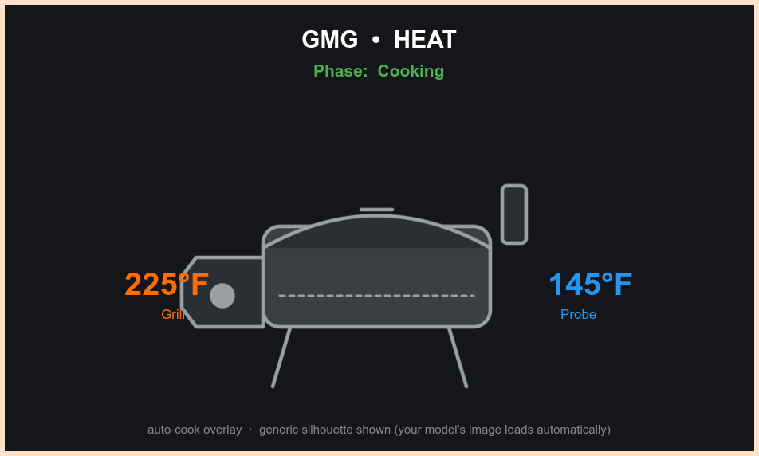
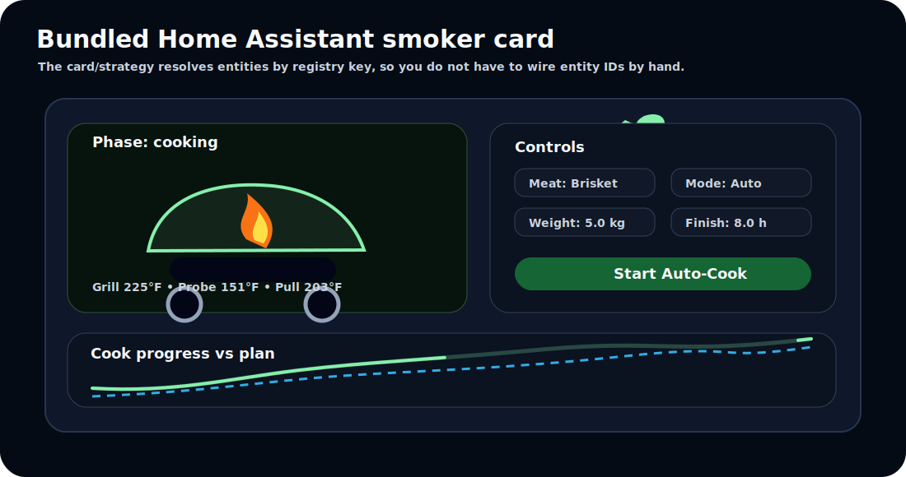
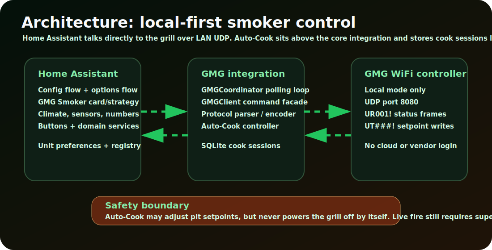
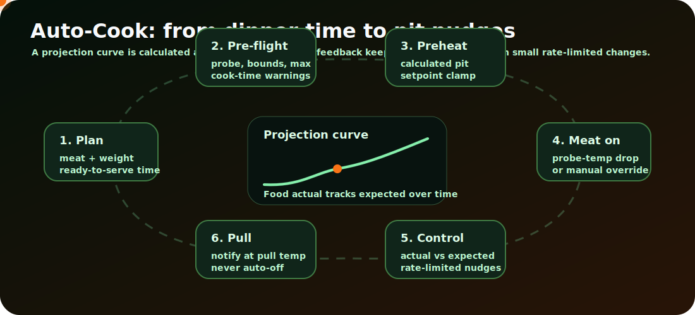
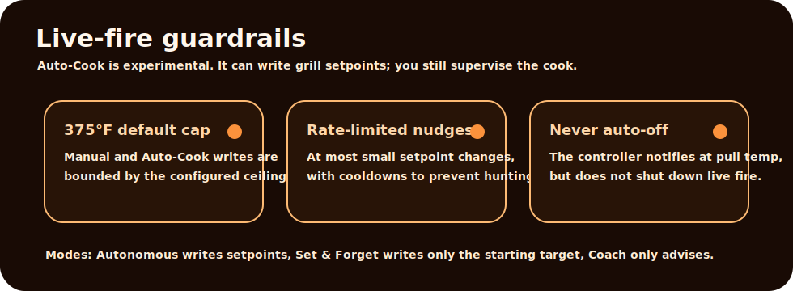

<p align="center">
  
</p>

<p align="center">
  <a href="https://hacs.xyz"></a>
  
  
  
  <a href="LICENSE"></a>
</p>

# Green Mountain Grills for Home Assistant — Auto-Cook Fork

Control and monitor Green Mountain Grills WiFi-enabled pellet smokers directly from Home Assistant — **locally, over your own LAN, with no cloud dependency**.

This fork keeps the original local GMG integration and adds an experimental **Auto-Cook** subsystem: physics-based cook planning, probe-feedback pacing, a bundled smoker dashboard card, configurable safety ceilings, unit preferences, and local SQLite cook-session tracking.

> [!WARNING]
> **Highly experimental live-fire software.** Auto-Cook can automatically adjust a pellet grill's pit setpoint. It includes guardrails, but it still controls a device involving fire, heat, food, and property risk. Always supervise your grill. Do not leave home while an automated cook is running. Use at your own risk.

> [!NOTE]
> This is a feature fork of [`hallyaus/Green-Mountain-Grills`](https://github.com/hallyaus/Green-Mountain-Grills). Core LAN protocol/control work is credited to **[hallyaus](https://github.com/hallyaus)**. This fork is maintained by **[giBiLatoR](https://github.com/giBiLatoR)** and focuses on Auto-Cook, dashboard UX, and cook orchestration.

---

## Contents

- [Why this fork exists](#why-this-fork-exists)
- [Gallery](#gallery)
- [Quick start](#quick-start)
- [How it works](#how-it-works)
- [Auto-Cook modes](#auto-cook-modes)
- [Safety guardrails](#safety-guardrails)
- [Bundled smoker dashboard](#bundled-smoker-dashboard)
- [Configuration options](#configuration-options)
- [Entities](#entities)
- [Services](#services)
- [Supported models](#supported-models)
- [Automation examples](#automation-examples)
- [Troubleshooting](#troubleshooting)
- [Development](#development)
- [Documentation map](#documentation-map)

---

## Why this fork exists

The upstream integration already gives Home Assistant proper local control of GMG smokers:

- climate entity for the grill
- temperature/probe/fault sensors
- power and Cold Smoke buttons
- services for setpoints and probe targets
- config flow, DHCP discovery, reconfigure flow and diagnostics
- no vendor cloud requirement once **Server Mode** is disabled

This fork adds the cooking layer on top:

| Addition | What it gives you |
|---|---|
| **Auto-Cook controller** | Tell it the meat, weight, probe and when you want to eat; it calculates a pit target and tracks the cook against a projection curve. |
| **Three cook modes** | Full autonomous setpoint control, set-and-forget tracking, or coach-only advice. |
| **Bundled smoker card** | A Home Assistant card/strategy that builds the whole smoker UI without hand-wiring entity IDs. |
| **Cook-session database** | SQLite session tracking at `/config/gmg_cooks.db`, with reference meat data imported from `cook-database.json`. |
| **Safety controls** | Configurable maximum grill temperature, small rate-limited adjustments, and a never-auto-off rule. |
| **Unit preferences** | Follow Home Assistant units or force °C/°F and kg/lb for the GMG integration. |

---

## Gallery

<p align="center">
  
</p>

<p align="center"><em>The bundled smoker overlay shows phase, live pit/probe temperatures, warning badges, and a heating glow.</em></p>

<p align="center">
  
</p>

---

## Quick start

### 1. Prepare the grill

The integration only works when the controller is in **local LAN mode**.

1. Open the GMG mobile app.
2. Connect to the grill.
3. Open WiFi settings.
4. Turn **Server Mode** off.
5. Keep Home Assistant and the grill on the same LAN/VLAN/SSID, or make sure UDP broadcasts can cross between them.

### 2. Install through HACS

1. Home Assistant → **HACS** → **Integrations**.
2. Open the three-dot menu → **Custom repositories**.
3. Add:

   ```text
   https://github.com/giBiLatoR/Green-Mountain-Grills
   ```

4. Category: **Integration**.
5. Install **Green Mountain Grills**.
6. Restart Home Assistant.

Manual install is also supported: copy `custom_components/gmg/` into `config/custom_components/gmg/`, then restart Home Assistant.

### 3. Add the integration

1. Home Assistant → **Settings** → **Devices & Services**.
2. **Add Integration** → search **Green Mountain Grills**.
3. Choose:
   - **Auto-discover** for same-LAN UDP discovery, or
   - **Manual** if you know the grill IP address.
4. The integration probes serial, firmware and model, then creates the device and entities.

### 4. Enable Auto-Cook when ready

Integration tile → **Configure**:

- set a **Maximum grill temperature** ceiling
- choose **Temperature unit** / **Weight unit** if desired
- enable **Auto Cook**
- optionally enable push notifications and development logging

---

## How it works

<p align="center">
  
</p>

The integration has three layers:

1. **Home Assistant layer** — config flow, options flow, entities, services, diagnostics and the bundled dashboard card.
2. **Integration layer** — `GMGCoordinator`, `GMGClient`, protocol parsing, command encoding, Auto-Cook controller and local SQLite cook sessions.
3. **Grill controller layer** — GMG WiFi controller speaking raw local UDP on port `8080`.

### The simple version

Think of the pellet grill as a wood-fired oven with a WiFi controller.

- The integration **watches**: every poll asks for pit temperature, probe temperatures, setpoints, power/fire state and warnings.
- Auto-Cook can **drive**: it calculates where the meat should be by now and, depending on mode, nudges the pit setpoint gently to stay on schedule.
- It does **not** need the vendor cloud once Server Mode is disabled.

<p align="center">
  
</p>

Auto-Cook state machine:

```text
IDLE → PLANNED → PREHEATING → WAITING_MEAT → COOKING ↔ IN_STALL → APPROACHING → PULL_REACHED → COMPLETE
```

Important language:

| Term | Meaning |
|---|---|
| **Pit temp** | Actual smoker chamber temperature. |
| **Pit setpoint** | Temperature the grill is commanded to hold. |
| **Pull temp** | Internal meat temperature where the cook is considered ready to pull. |
| **Projection curve** | Expected probe temperature over time for the chosen meat/weight/finish time. |
| **Cook start detection** | Probe drops rapidly when it moves from hot chamber air into cold meat. |
| **Stall** | Evaporative cooling plateau around 158–170°F. |

---

## Auto-Cook modes

| Mode | Auto power-on | Sets pit at start | Ongoing setpoint writes | Best for |
|---|---:|---:|---:|---|
| **Autonomous** | Yes | Yes | Yes, rate-limited | Let the integration keep the cook on schedule. |
| **Set & Forget** | Yes | Yes | No | Let it preheat and track, but avoid mid-cook writes. |
| **Coach** | No | No | No | Human-in-the-loop guidance only. |

All modes share the same meat database, projection curve, state machine and milestone notifications. They differ only in how much control the integration takes over the physical grill.

Auto-Cook inputs:

- meat type from `cook-database.json`
- weight
- primary probe
- cook mode
- finish-in-hours target
- configured maximum pit temperature

Auto-Cook outputs:

- calculated starting pit target
- cook state / phase
- elapsed and remaining minutes
- expected probe temperature
- pull target
- on-schedule binary sensor
- notifications and/or setpoint adjustments depending on mode

---

## Safety guardrails

<p align="center">
  
</p>

| Guardrail | Current behaviour |
|---|---|
| **Default max pit ceiling** | `375°F`, configurable in integration options and bounded by GMG's supported range. |
| **Minimum pit setpoint** | `150°F`. |
| **Maximum adjustment delta** | Small proportional setpoint changes, capped around 2% of target. |
| **Cooldown between adjustments** | Larger changes wait longer before another write. |
| **Never auto-power-off** | Pull reached triggers notification; the integration does not shut down live fire. |
| **Pit failure signal** | Very low pit after being hot can trigger a critical warning. |
| **Dev logging opt-in** | Optional SQLite poll-cycle logging for analysis/calibration only. |

> [!IMPORTANT]
> Guardrails reduce risk; they do not remove it. Pellet grills can flare, run out of pellets, lose WiFi, misread probes, or behave differently across firmware generations.

---

## Bundled smoker dashboard

The integration ships a self-contained Lovelace card and view strategy served from `custom_components/gmg/static/gmg-smoker-strategy.js`.

### Add a single card

Dashboard → **Edit** → **Add Card** → search **GMG Smoker**.

YAML equivalent:

```yaml
type: custom:gmg-smoker-card
# serial: GMG12137138   # optional, only needed with multiple grills
# show_graph: false     # optional
```

### Generate a whole view

```yaml
strategy:
  type: custom:gmg-smoker
  # serial: GMG12137138
  # show_graph: true
```

The card resolves entities by registry translation key, not fragile entity IDs, so it should survive renames.

Dashboard features:

- model-aware smoker image with generic fallback
- phase/status overlay
- live grill and probe temperatures
- warning and low-pellet indicators
- manual controls when Auto-Cook is off
- setup controls when Auto-Cook is idle
- live cook readout and abort/meat-on controls while cooking
- native inline-SVG cook progress chart — no ApexCharts dependency

Model artwork convention:

```text
custom_components/gmg/static/models/<model_id>.png
```

If a matching transparent PNG exists, the card uses it. Otherwise it falls back to `smoker-generic.svg`.

---

## Configuration options

The integration uses UI setup only — no YAML required.

| Option | Default | Purpose |
|---|---:|---|
| **Scan interval** | `15s` | Coordinator polling cadence. UI warns below `5s`. |
| **Maximum grill temperature** | `375°F` | Ceiling for manual setpoint and Auto-Cook writes. |
| **Temperature unit** | Auto | Follow Home Assistant or force °C/°F for GMG temperature entities and notifications. |
| **Weight unit** | Auto | Follow Home Assistant or force kg/lb for the cook-weight input and notifications. |
| **Enable Auto Cook** | Off | Auto-Cook entities and control loop are opt-in. |
| **Development mode** | Off | Extra SQLite poll logging during active cooks. |
| **Push notifications** | Off | Enables Auto-Cook milestone notifications where supported. |

The grill protocol is natively Fahrenheit. Unit preferences affect Home Assistant display/registry overrides and notification formatting; calculations remain canonical internally.

---

## Entities

### Core grill entities

| Platform | Entity | Notes |
|---|---|---|
| `climate` | Grill | Current/target temp, heat/off/fan-only, Cold Smoke preset. |
| `sensor` | Grill temperature | Pit temperature. |
| `sensor` | Probe 1 / Probe 2 temperature | `None` when unplugged (`89°F` sentinel). |
| `sensor` | Probe targets | Echoes controller targets. |
| `sensor` | Power state / fire state / warning | Controller state and diagnostics. |
| `sensor` | Hopper percent | Diagnostic; firmware support varies. |
| `binary_sensor` | Flame on / cooking / low pellets | Runtime and problem indicators. |
| `binary_sensor` | Fan / auger / ignitor faults | Problem diagnostics. |
| `number` | Grill setpoint | Manual pit setpoint, capped by configured maximum. |
| `number` | Probe target numbers | Probe target temperatures. |
| `button` | Power On / Power Off / Cold Smoke | Direct controller actions. |

### Auto-Cook entities

| Platform | Entity | Notes |
|---|---|---|
| `select` | Cook meat type | 21 cuts from the reference database. |
| `select` | Cook mode | Set & Forget / Autonomous / Coach. |
| `select` | Cook probe | Probe 1 or Probe 2. |
| `number` | Cook weight | kg/lb depending on unit preference. |
| `number` | Cook finish in | Desired ready-to-serve horizon in hours. |
| `sensor` | Cook state / phase | State machine and thermal phase. |
| `sensor` | Cook meat | Human-friendly current meat. |
| `sensor` | Cook elapsed / remaining minutes | Live timing. |
| `sensor` | Cook pit target | Calculated pit setpoint. |
| `sensor` | Cook expected probe temp | Projection curve at current elapsed time. |
| `sensor` | Cook pull temp | Internal meat target. |
| `binary_sensor` | Cook on schedule | Actual probe vs projected probe tolerance. |
| `button` | Start cook / Abort cook | Session lifecycle. |
| `button` | Meat is on | Manual override for cook-start detection. |

---

## Services

| Service | Fields | Purpose |
|---|---|---|
| `gmg.set_probe_target` | `config_entry_id`, `probe`, `temperature` | Set probe 1/2 target from Developer Tools or automation. |
| `gmg.refresh` | `config_entry_id` | Force an immediate poll. |
| `gmg.start_cook` | `config_entry_id`, `meat_key`, `weight_kg`, `probe`, `mode`, `finish_in_hours` | Start Auto-Cook from service data. |
| `gmg.abort_cook` | `config_entry_id` | Cancel the active cook session. |

Most users should use the dashboard card/buttons. Services are useful for automations, scripts and advanced dashboards.

---

## Supported models

See [`docs/MODELS.md`](docs/MODELS.md) for the full controller matrix. In short, the integration targets WiFi-capable GMG controllers that speak the local UDP protocol:

| Model family | WiFi LAN | Probes | Notes |
|---|---:|---:|---|
| Trek / Davy Crockett | Yes | 1–2 | Legacy and Prime generations vary by controller. |
| Ledge / Daniel Boone | Yes | 2 | Prime, Prime+ and Prime 2.0 variants. |
| Peak / Jim Bowie | Yes | 2 | Prime, Prime+ and Prime 2.0 variants. |

Not exposed by the local protocol: grill light switch, reliable hopper percentage on all firmwares, Smart Smoke setting, and multi-stage profile upload.

---

## Automation examples

### Notify when the grill reaches its setpoint

```yaml
automation:
  - alias: "Grill reached setpoint"
    triggers:
      - trigger: numeric_state
        entity_id: sensor.gmg_grill_temperature
        above: 224
    conditions:
      - condition: state
        entity_id: binary_sensor.gmg_flame_on
        state: "on"
    actions:
      - action: notify.mobile_app
        data:
          message: "Grill is up to temp — load the meat."
```

### Alert on low pellets

```yaml
automation:
  - alias: "GMG low pellets"
    triggers:
      - trigger: state
        entity_id: binary_sensor.gmg_low_pellets
        to: "on"
        for: "00:01:00"
    actions:
      - action: notify.mobile_app
        data:
          message: "GMG hopper is low — top it up before the next session."
```

### Preheat on a schedule

```yaml
automation:
  - alias: "GMG preheat at 17:00"
    triggers:
      - trigger: time
        at: "17:00:00"
    actions:
      - action: button.press
        target:
          entity_id: button.gmg_power_on
      - delay: "00:00:30"
      - action: climate.set_temperature
        target:
          entity_id: climate.gmg_grill
        data:
          temperature: 225
```

### Start an Auto-Cook session from a script

```yaml
script:
  start_brisket_auto_cook:
    sequence:
      - action: gmg.start_cook
        data:
          config_entry_id: YOUR_CONFIG_ENTRY_ID
          meat_key: beef_brisket_packer
          weight_kg: 5.0
          probe: 1
          mode: autonomous
          finish_in_hours: 10
```

---

## Troubleshooting

| Symptom | Check first |
|---|---|
| No devices found | Server Mode must be off; grill and HA must share a broadcast domain. |
| Manual IP works but discovery fails | VLAN/firewall/broadcast forwarding issue, not the integration. |
| Grill unavailable | Power-cycle controller; confirm UDP `8080` both directions. |
| Probe reads `None` | GMG uses `89°F` as unplugged sentinel; check probe seating. |
| Auto-Cook phase stays idle | Auto-Cook is disabled or no session has been started. |
| Waiting for meat never transitions | Press **Meat is on** if the probe was already in cold meat and no temperature drop happened. |
| Unit display looks wrong | Check Temperature unit / Weight unit options and HA global unit system. |

Debug logging:

```yaml
logger:
  default: info
  logs:
    custom_components.gmg: debug
```

Then reproduce the issue and download diagnostics from the integration's device page.

---

## Development

```bash
python3 -m venv .venv
source .venv/bin/activate
pip install -r requirements.test.txt
ruff check .
ruff format --check .
mypy custom_components/gmg
pytest
```

CI runs lint, typing and tests on push/PR. Behavioural changes should include or update tests.

---

## Documentation map

| File | Purpose |
|---|---|
| [`docs/INSTALL.md`](docs/INSTALL.md) | Full install and troubleshooting guide. |
| [`docs/MODELS.md`](docs/MODELS.md) | Supported controller/model matrix. |
| [`docs/PROTOCOL.md`](docs/PROTOCOL.md) | Local UDP command/status-frame reference. |
| [`ARCHITECTURE.md`](ARCHITECTURE.md) | Detailed integration architecture. |
| [`CONTEXT.md`](CONTEXT.md) | Auto-Cook domain terminology, guardrails and state machine. |
| [`cook-database.json`](cook-database.json) | Meat reference database used by the cook model. |

---

## License

[MIT](LICENSE). Core integration copyright 2026 hallyaus. Auto-Cook extension copyright 2026 giBiLatoR.
